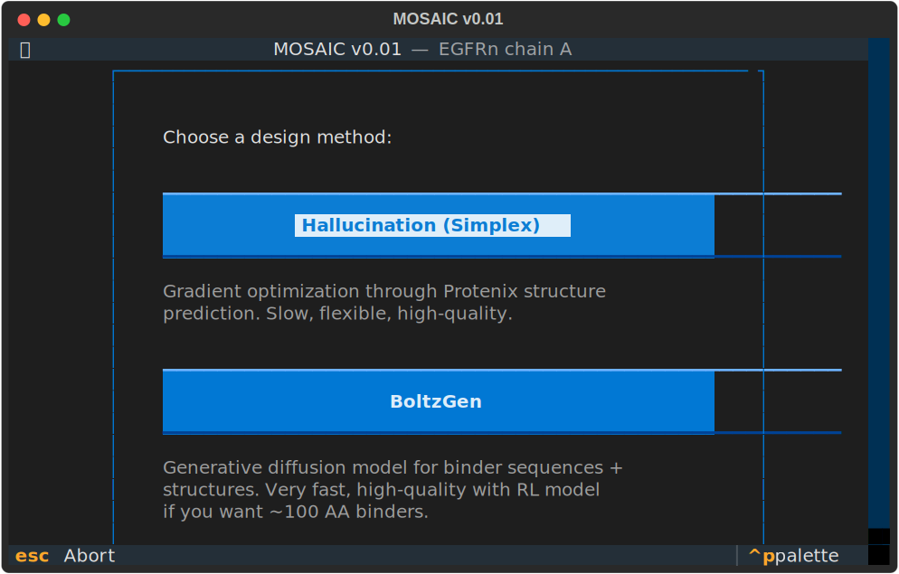
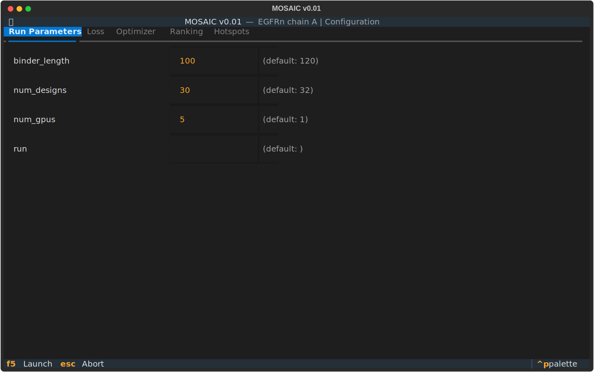
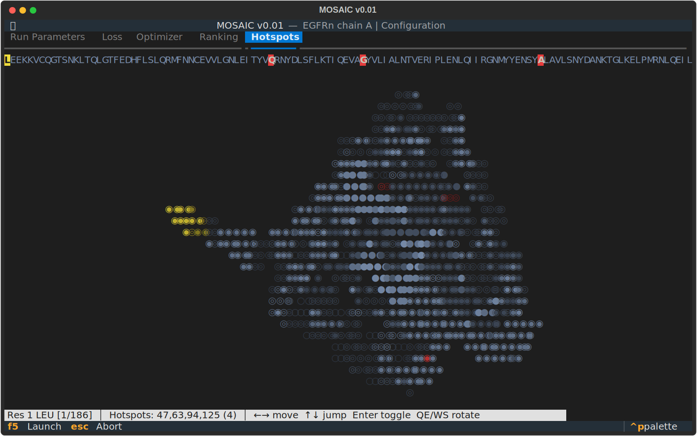
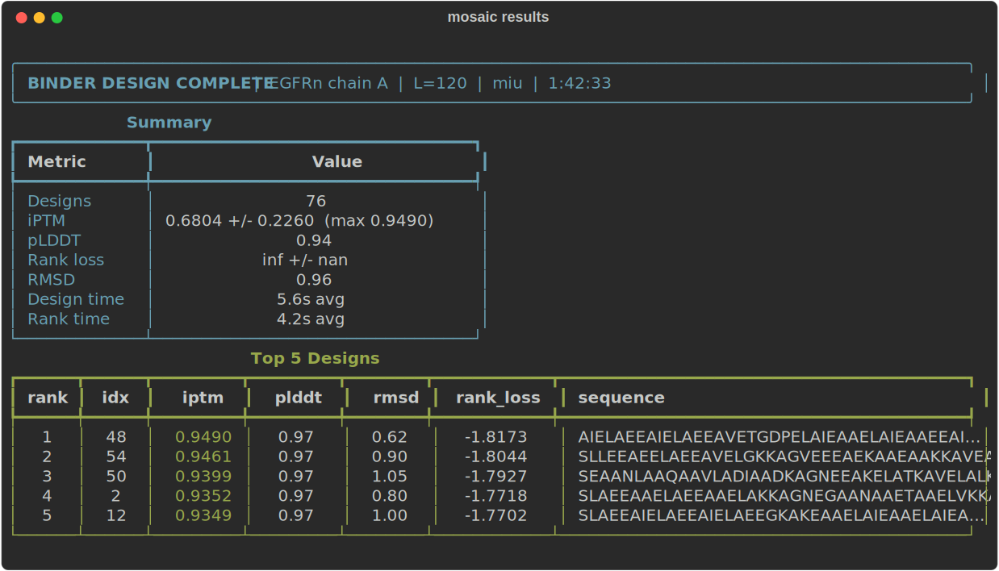

# MOSAIC TUI

This is a needlessly baroque Terminal UI frontend for [mosaic](https://github.com/escalante-bio/mosaic) protein binder design, coupled with a fairly good backend on [Modal](https://modal.com) for distributed GPU compute.

<p align="center">
  
</p>

## Setup

Requires [uv](https://docs.astral.sh/uv/) and a [Modal](https://modal.com) account.

```bash
uv sync
modal setup
```

## Quick start

```bash
uv run mosaic --cif targets/CCL2.cif --chain M --binder-length 100 --num-designs 30 --num-gpus 5
```

This opens an interactive config screen. Press F5 (or Ctrl-S) to launch the run.

## Design methods

```
            target.cif + chain           sequence only
                    |                         |
          .---------+---------.               |
          |                    |              |
    [Hallucination]       [BoltzGen]    [Hallucination]
     simplex_APGM       diffusion       simplex_APGM
          |              sampling       (no template)
          |                    |              |
          '---------+----------'--------------'
                    |
               [Ranking]
          Protenix refold +
          iPTM/iPSAE scoring
                    |
              summary.csv
```

### Simplex (default)

Gradient-based optimization using `simplex_APGM` from `mosaic`. Three phases optimize a soft sequence through Protenix structure prediction + proteinmpnn loss. The dashboard shows live loss curves per GPU.

```bash
uv run mosaic --cif target.cif --chain A
```

### BoltzGen

Generative model for binder sequences and structures.

Two weight variants are available. **RL weights** (default) have been fine-tuned with reinforcement learning on a `mosaic` loss. **Base weights** are also available.

```bash
uv run mosaic --cif target.cif --chain A --method boltzgen
uv run mosaic --cif target.cif --chain A --method boltzgen --no-rl-checkpoint  # base weights
```

### Structure-free hallucination

Design binders against a target sequence alone (no structure file). Only simplex is supported. There is no template, so Protenix predicts the target structure from sequence during optimization.

```bash
uv run mosaic --sequence MKVLWAALLVTFLAGCQAKVEQAVETEPEPELRQQTEWQSGQ...
```

## Screens

### Method picker

Choose between Simplex (gradient optimization) and BoltzGen (diffusion sampling) at the start of each run.

<p align="center">
  
</p>

### Config screen

Full-screen editor for all design parameters: loss weights, optimizer hyperparameter ranges, ranking settings. Changed values are highlighted. Press F5 to launch.

<p align="center">
  
</p>

### Hotspot selector

Interactive 3D structure viewer for choosing target epitope residues. Arrow keys navigate the sequence, Enter toggles hotspots, Q/E/W/S rotate the structure.

<p align="center">
  
</p>

### Loading screen

A spinning ASCII protein structure while Modal builds the container image and downloads model weights.

<p align="center">
  
</p>

### Live dashboard

Real-time monitoring of GPU workers, ranked results table, loss trajectory chart, and spinning 3D protein viewer. Click a row to view the designed binder structure. Press `b` to toggle binder/complex view, `d` to switch dot/block rendering.

<p align="center">
  
</p>

### Run summary

After completion, a summary table with statistics and top designs is printed to the terminal.

<p align="center">
  
</p>

## Ranking

Every design is ranked after optimization by folding the binder-target complex with Protenix and scoring iPTM + iPSAE. The binder is also folded as a monomer to check structural consistency.

**Default (fast) ranking** reuses the features built during design. Skips the per-sequence feature rebuild and avoids a re-JIT. This is fast and good enough for most runs.

**Full ranking** (`--full-ranking`) rebuilds Protenix features from scratch for each sequence. This is more accurate because it incorporates the designed sequence (and sidechains!) into feature processing, but it's slow -- ranking can take longer than the design itself (especially when using BoltzGen).

```bash
# Default: fast ranking, no per-sequence re-JIT
uv run mosaic --cif target.cif --chain A --num-designs 200

# Full: rebuild features per sequence, proper sidechains
uv run mosaic --cif target.cif --chain A --num-designs 50 --full-ranking
```

When resuming a run with `--run`, the ranking config is locked to whatever was used in the original run. This ensures all designs in a run are ranked with the same method so scores are comparable. The config screen shows the ranking tab as locked.

## Runs and results

A **run** is a named batch of designs against a single target. The name is either auto-generated from a timestamp (e.g. `20260303_012655`) or set explicitly with `--run`. Passing `--run` with an existing name resumes that run, reloading its config and skipping already-completed designs.

Each run is self-contained in `results/<run>/`:

```
results/20260303_012655/
    config.json              Full config: loss weights, hyperparameter ranges, ranking settings
    CCL2.cif                 Copy of the target structure (for reproducibility)
    uv.lock                  Copy of the lockfile at launch time
    summary.csv              All designs ranked by ranking loss (written at end of run)
    design_<seed>.json       Per-design data: sequence, metrics, hyperparams, PDB strings
    design_<seed>.pdb        Binder-target complex structure
    design_<seed>_monomer.pdb  Binder folded alone (for monomer RMSD check)
```

Design JSONs and PDBs are written to disk by the dashboard as each design completes, so partial results survive interrupts. `summary.csv` is written once at the end (or on resume completion).

To download results saved on the Modal volume:

```bash
modal volume get design-results <run_name>/ results/<run_name>/
```

## Running headless

`--no-config` skips the config screen and uses CLI defaults directly. Useful for scripts and CI:

```bash
# Launch with all defaults, no interactive config
uv run mosaic --cif targets/CCL2.cif --chain M --no-config

# Fully specified -- nothing interactive except the dashboard
uv run mosaic --cif targets/CCL2.cif --chain M \
  --method boltzgen --binder-length 80 --num-designs 50 --num-gpus 4 --no-config
```

Alternatively, configure once interactively, then resume headless. The first run saves `config.json` with all settings; `--run` reloads it:

```bash
# Interactive: tweak config, press F5, Ctrl+C after a few designs
uv run mosaic --cif targets/CCL2.cif --chain M --run experiment1

# Headless: resume same config, scale up
uv run mosaic --run experiment1 --num-designs 200 --num-gpus 8 --no-config
```

The dashboard itself still runs (it's just a display), but no user input is required after launch.

## CLI reference

| Flag | Default | Description |
|------|---------|-------------|
| `--cif` | | Target structure in CIF format (required unless `--sequence` or `--run`) |
| `--chain` | A | Target chain ID |
| `--sequence` | | Target amino acid sequence for structure-free design (mutually exclusive with `--cif`) |
| `--binder-length` | 120 | Binder length in residues |
| `--num-designs` | 32 | Total number of designs |
| `--num-gpus` | 1 | Number of B200 GPUs |
| `--method` | simplex | `simplex` or `boltzgen` |
| `--run` | (auto) | Run name; reuse to resume |
| `--hotspots` | (none) | Comma-separated 0-indexed target residue indices |
| `--recycling-steps` | 6 | Recycling steps (simplex) |
| `--num-samples` | 4 | Diffusion samples per loss eval (simplex) |
| `--no-msa` | false | Disable MSA for target chain |
| `--fast` | false | Contact losses only, 1 recycle step |
| `--full-ranking` | false | Rebuild features per sequence for ranking (slower, more accurate) |
| `--rl-checkpoint` / `--no-rl-checkpoint` | on | RL post-trained BoltzGen weights |
| `--no-trim` | false | Include unresolved terminal residues from entity sequence |
| `--no-config` | false | Skip config screen |

## Performance

All compute runs remotely on Modal GPUs. The local machine just runs the TUI and collects results to write to disk.

**First run ever** is the slowest. Modal builds the container image (~5 min), then downloads model weights (~3 min). Both are cached for subsequent runs.

**Cold start per GPU** takes 30-60s as models load into GPU memory. This happens each time a new GPU container spins up. With `--num-gpus 5`, all five load in parallel, so wall time is the same as one GPU.

**Scaling with GPUs** is linear -- designs are independent.

**JIT compilation** adds a one-time overhead on each GPU the first time a new configuration shape is seen (different binder length, different recycling steps, etc.). Subsequent designs on the same GPU reuse compiled kernels.

For large runs, warm the JIT cache first with a single GPU, then relaunch with more:

```bash
# Warm the JIT cache with 1 GPU, Ctrl+C after the first design completes
uv run mosaic --cif targets/CCL2.cif --chain M --run big_run --num-designs 1 --num-gpus 1

# Relaunch with many GPUs -- all skip JIT
uv run mosaic --run big_run --num-designs 200 --num-gpus 8
```

## Regenerating screenshots

```bash
uv run python scripts/screenshots.py   # static SVGs + animated GIFs
vhs scripts/demo.tape                  # config screen flow (animated GIF)
```
